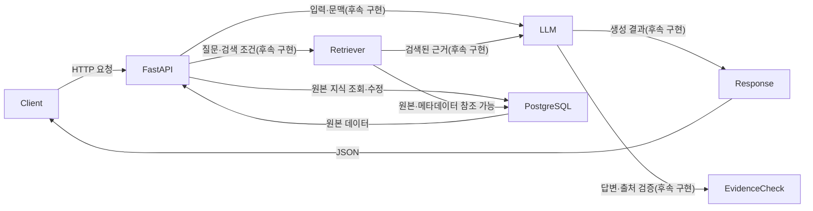

# AI 지식 플랫폼 개념도

```mermaid
flowchart LR
  N0["Client"]
  N1["EvidenceCheck"]
  N2["FastAPI"]
  N3["LLM"]
  N4["PostgreSQL"]
  N5["Response"]
  N6["Retriever"]
  N0 -->|"HTTP 요청"| N2
  N2 -->|"원본 지식 조회·수정"| N4
  N4 -->|"원본 데이터"| N2
  N2 -->|"입력·문맥(후속 구현)"| N3
  N3 -->|"생성 결과(후속 구현)"| N5
  N5 -->|"JSON"| N0
  N2 -->|"질문·검색 조건(후속 구현)"| N6
  N6 -->|"원본·메타데이터 참조 가능"| N4
  N6 -->|"검색된 근거(후속 구현)"| N3
  N3 -->|"답변·출처 검증(후속 구현)"| N1
```
