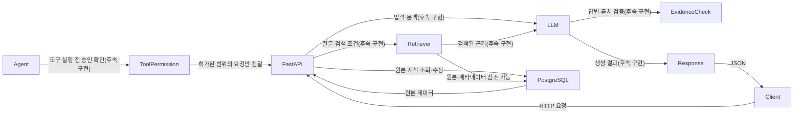

# AI 지식 플랫폼 개념도

```mermaid
flowchart LR
  N0["Agent"]
  N1["Client"]
  N2["EvidenceCheck"]
  N3["FastAPI"]
  N4["LLM"]
  N5["PostgreSQL"]
  N6["Response"]
  N7["Retriever"]
  N8["ToolPermission"]
  N1 -->|"HTTP 요청"| N3
  N3 -->|"원본 지식 조회·수정"| N5
  N5 -->|"원본 데이터"| N3
  N3 -->|"입력·문맥(후속 구현)"| N4
  N4 -->|"생성 결과(후속 구현)"| N6
  N6 -->|"JSON"| N1
  N3 -->|"질문·검색 조건(후속 구현)"| N7
  N7 -->|"원본·메타데이터 참조 가능"| N5
  N7 -->|"검색된 근거(후속 구현)"| N4
  N4 -->|"답변·출처 검증(후속 구현)"| N2
  N0 -->|"도구 실행 전 승인 확인(후속 구현)"| N8
  N8 -->|"허가된 범위의 요청만 전달"| N3
```
